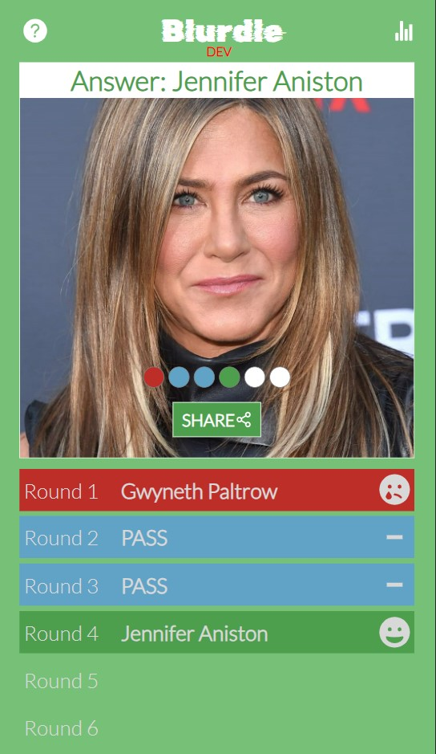

<a id="readme-top"></a>

<div align="center">

  <a href="https://github.com/emily83/blurdle">
    
  </a>

  <p align="center">
    Daily Guessing Game
    <br />
    <a href="https://github.com/emily83/Blurdle"><strong>Explore the docs »</strong></a>
  </p>
</div>

<!-- TABLE OF CONTENTS -->
<details>
  <summary>Table of Contents</summary>
  <ol>
    <li>
      <a href="#about-the-project">About The Project</a>
      <ul>
        <li><a href="#how-to-play">How To Play</a></li>
        <li><a href="#built-with">Built With</a></li>
        <li><a href="#project-architecture">Project Architecture</a></li>
      </ul>
    </li>
    <li>
      <a href="#getting-started">Getting Started</a>
      <ul>
        <li><a href="#prerequisites">Prerequisites</a></li>
        <li><a href="#installation">Installation</a></li>
      </ul>
    </li>
    <li><a href="#usage">Usage</a></li>
    <li><a href="#contact">Contact</a></li>
  </ol>
</details>

<!-- ABOUT THE PROJECT -->

## About The Project

Blurdle is a daily guessing game, based on the Wordle trend, designed to be played on mobile browsers.

<div style="display: flex; justify-content: space-between">
  
  
    
</div>

<p align="right">(<a href="#readme-top">back to top</a>)</p>

### How To Play

Guess the famous person from the blurry photo.

You have 6 guesses and must answer with the full name.

After each wrong guess or pass, the photo will get less blurry.

Guess in as few guesses as possible and share your score!

### Built With

The site is built on the MERN stack (MongoDB, Express, React, Node.js) and uses AWS S3.

### Project Architecture

The front end of the website uses React. State is managed using the Context API.

The back end uses Node.js with Express. A MongoDB database holds the data for the game, including the url for each day's picture for guessing. Mongoose is used for interacting with the database.

The daily pictures are stored in an AWS S3 cloud storage bucket. The picture is retrieved from S3 then blurred using the Jimp image processing library and returned in JSON from the API to be consumed by the client.

There is an admin panel for adding the daily pictures which uses Passport as authentication middleware and JSON web tokens.

<p align="right">(<a href="#readme-top">back to top</a>)</p>

<!-- GETTING STARTED -->

## Getting Started

To get a local copy of the website up and running follow these steps.

### Prerequisites

You will need to have Node.js installed, and the latest version of npm.

- Get the latest version of npm
  ```sh
  npm install npm@latest -g
  ```

A MongoDB database needs creating with 3 collections - pictures, counters and admins.

An AWS S3 bucket needs setting up.

### Installation

1. Clone the repo
   ```sh
   git clone https://github.com/emily83/blurdle.git
   ```
2. Change directory to the newly cloned repo
   ```sh
   cd blurdle
   ```
3. Install server NPM packages

   ```sh
   npm install
   ```

4. Install client NPM packages

   ```sh
   cd client
   npm install
   ```

5. Create config file `config/config.env`
   ```js
   NODE_ENV = development;
   PORT = 5000;
   MONGO_URI_TEST = YOUR_MONGODB_CONNECTION_STRING;
   AWS_ACCESS_KEY_ID = YOUR_ACCESS_KEY;
   AWS_SECRET_ACCESS_KEY = YOUR_SECRET_KEY;
   S3_BUCKET_TEST = blurdle - test;
   ```

<p align="right">(<a href="#readme-top">back to top</a>)</p>

<!-- USAGE EXAMPLES -->

## Usage

To run the website in your development environment, you need to start the server

```sh
npm run dev
```

This will run the website at http://localhost:3000.

The backend API will run on localhost port 5000.

<p align="right">(<a href="#readme-top">back to top</a>)</p>

<!-- CONTACT -->

## Contact

Emily Couzens - emilycouzens@hotmail.co.uk

Project Link: [https://github.com/emily83/blurdle](https://github.com/emily83/blurdle)

<p align="right">(<a href="#readme-top">back to top</a>)</p>
